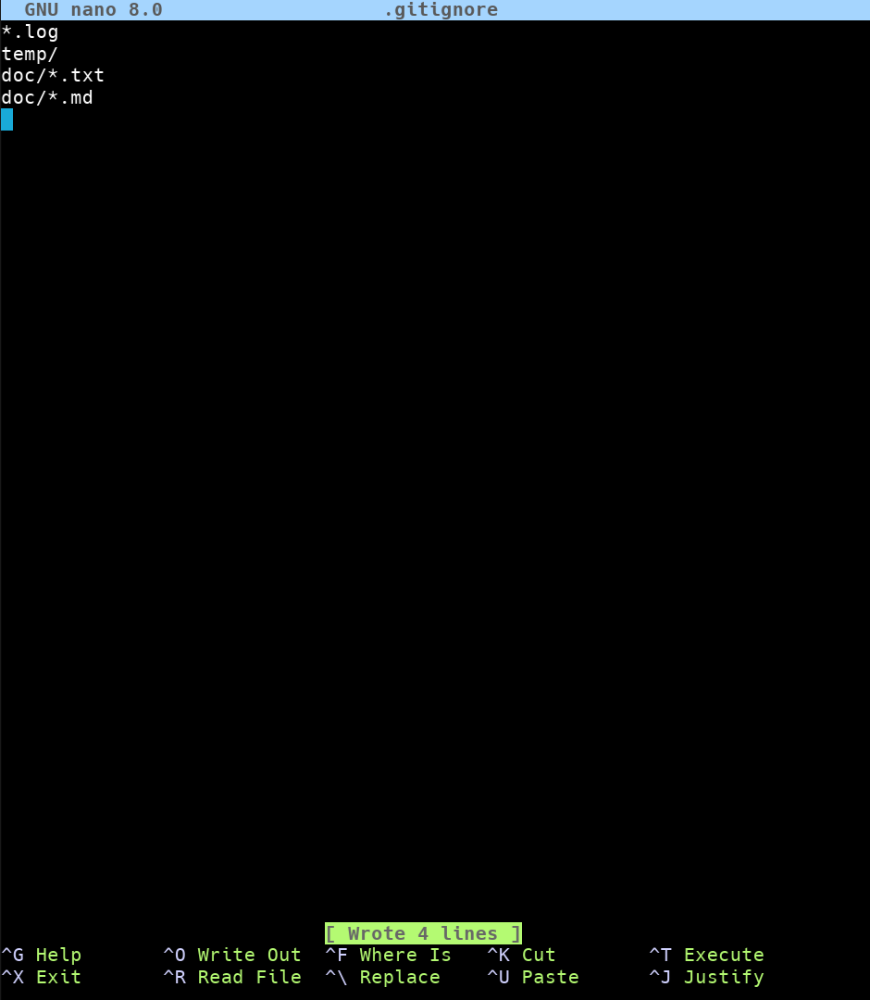
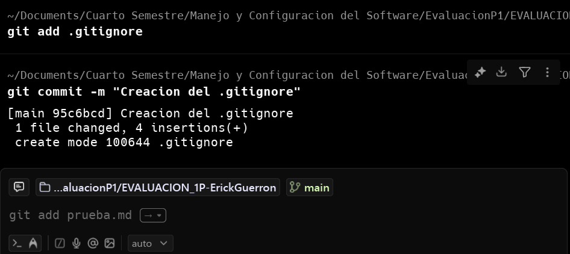
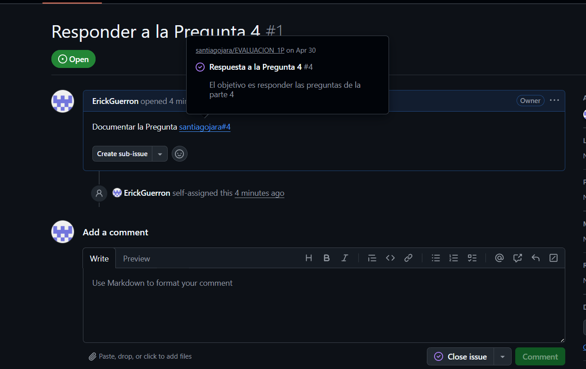

# Universidad Tecnica de Ambato   
## Facultad de Ingenieria en sistemas, electronica e industrial  
### Carrera de Ingeniería en Software  

**Asignatura:** Manejo y Configuración de Software  
**Nombre del Estudiante:** Erick Guerrón 
**Fecha:** 07/10/2025  

---

# Evaluación Práctica de Git y GitHub

## Instrucciones Generales

- Cada pregunta debe ser respondida directamente en este archivo **(README.md)** debajo del enunciado correspondiente.
- Cada respuesta debe ir acompañada de uno o más **commits**, según se indique en cada pregunta.
- Cuando se indique, deberán realizarse acciones prácticas dentro del repositorio (como creación de archivos, ramas, resolución de conflictos, etc.).
- Cada pregunta debe estar **etiquetada con un tag**, únicamente en el commit final correspondiente, con el formato: `"Pregunta 1"`, `"Pregunta 2"`, etc.

---

## Pregunta 1 (1 punto)

**Explicar la diferencia entre los siguientes conceptos/comandos en Git y GitHub:**

- `git clone`  
- `fork`  
- `git pull`

La diferencia clave es que git clone clona todo el repositorio y lo trae a la parte local, fork clona el repositorio remoto en el repositorio remoto personal de la cuenta de github con la opcion de dar sugerencias al creador del proeycto clonado y el git pull solo trae del repositorio los archivos que han sufrido algun cambio ademas de las ramas remotas creadas.

### Parte práctica:

- Realizar un **fork** de este repositorio en la cuenta personal de GitHub del estudiante.
- Luego, realizar un **clone** del fork en el equipo local.
- En este README, describir el proceso seguido:
  - ¿Cómo se realizó el fork?
  - ¿Cómo se realizó el clone del fork?
  - ¿Cómo se verificó que se estaba trabajando sobre el fork y no sobre el repositorio original?

**📝 Respuesta:**
  
<!-- Escribe aquí tu respuesta a la Pregunta 1 -->
  
  
  Se realizo correctamente el fork al ir a github selccionar el repositorio al cual se le desea hacer un fork (ojo tiene que ser un repositorio publico), se da al boton de fork y se da en create new fork, se le da un titulo y una descripcion (opcional) y se da en el boton de crear.

  

  Para la clonacion del proyecto primero se debe ir al repositorio creado por el fork y copiar el link del repositorio y utilizando el comando git clone <url> se logra clonar el repositorio.

  

  Como ultimo punto para verificar uqe no se este trabajando en el repositorio original solo se debe de asegurar que se haya copiado el link del reposotirio creado por el fork en su espacio privado de esa manera neustros cambios se veran reflejados solo en neustro fork, almenos que hagamos un pull request al crear del repositorio original y nos acepte nuestros cambios.

---

## Pregunta 2 (1 punto)

**Configurar un archivo `.gitignore` para que ignore:**

- Todos los archivos con extensión `.log`.
- Una carpeta llamada `temp/`.
- Todos los archivos `.md` y `.txt`de la carpeta `doc/`. (Probar agregando un archivo `prueba.md` y un archivo `prueba.txt` dentro de la carpeta y fuera de la carpeta.)

Se creo el archivo .gitignore por medio del comando touch.

Por medio de nano se implementaron las restricciones propuestas por la pregunta 2.

Se creacion los archivos de prueba para la prueba del git ignore.

### Requisitos:

1. Realizar un **primer commit** que incluya únicamente el archivo `.gitignore` con las reglas de exclusión definidas.

2. Realizar un **segundo commit** donde se explique en este README la función del archivo `.gitignore` y se muestre evidencia de que los archivos y carpetas indicadas no están siendo rastreadas por Git.

Como se puede observar en la arrea de preparacion solo constan los archivos de prueba que no estan dentro de la carpeta doc, por lo que se concluye que el .gitignore esta en funcionamiento.

**Importante:**  
- Solo el **segundo commit** debe llevar el **tag `"Pregunta 2"`**.

**📝 Respuesta:**

<!-- Escribe aquí tu explicación y evidencia para la Pregunta 2 -->
El .gitignore es la parte mas importante dentro de cualquier repositorio ya que nos ayuda a ignorar archivos que sean irrelevantes de llevar un seguimiendo siendo que son estaticos como el caso de el package.js o los .class de java.qq
---q

## Pregunta 3 (2 puntos)

**Utilizar Git Flow para desarrollar una nueva funcionalidad llamada `ingresar-encabezado`.**

### Requisitos:

- Inicializar el repositorio con Git Flow, utilizando las ramas por defecto: `main` y `develop`.
- Crear una rama de tipo `hotfix` con el nombre `ingresar-encabezado`.
- En dicha rama, **completar con los datos personales del estudiante** el encabezado que ya se encuentra al inicio de este archivo `README.md`.
- Realizar al menos un commit durante el desarrollo.
- Finalizar el hotfix siguiendo el flujo de trabajo establecido por Git Flow.

### En este README, se debe incluir:

- Los **comandos exactos** utilizados desde la inicialización de Git Flow hasta el cierre del hotfix.
- Una descripción del **proceso seguido**, indicando el propósito de cada paso.
- Una reflexión sobre las **ventajas de aplicar Git Flow**, especialmente en contextos colaborativos o proyectos de larga duración.

**Importante:**

- Deben realizarse varios commits durante esta pregunta.
- **Solo el commit final** debe llevar el **tag `"Pregunta 3"`**.
- El flujo debe respetar la estructura de Git Flow con las ramas `develop` y `main`.

**📝 Respuesta:**

<!-- Escribe aquí tu respuesta completa a la Pregunta 3 -->

---

## Pregunta 4 (2 puntos)

**Trabajo con Issues y Pull Requests**

### Parte teórica:

- Explicar qué es un **issue** en GitHub.
- Explicar qué es un **pull request** y cuál es su finalidad.
- Indicar la diferencia entre ambos y cómo se relacionan en un entorno de trabajo colaborativo.

### Parte práctica:

- Trabajar en la rama `develop`, ya existente desde la configuración de Git Flow.
- Crear un **issue** titulado `"Respuesta a la Pregunta 4"`, en el que se indique que su objetivo es documentar esta pregunta.
- Realizar los cambios necesarios en este archivo `README.md` para responder esta pregunta.
- Realizar un **commit** con los cambios y subirlo a la rama `develop` del repositorio remoto.
- Crear un **pull request** desde `develop` hacia `main` en GitHub.
- **Vincular el pull request con el issue creado**, de manera que al ser aprobado y fusionado, el issue se cierre automáticamente.
- **Aprobar** el pull request para que se haga el merge respectivo hacia `main`.

### En este README, se debe incluir:

- Un resumen del procedimiento realizado.
- El número y enlace del issue creado.
- El número y enlace al pull request.

**📝 Respuesta:**

<!-- Escribe aquí tu respuesta completa a la Pregunta 4 -->

En resumen para poder crear un issue desde el fork se necesita habilitar primero la opcion de crear issues en setting.

Una vez activado se debe ir al apartado de issues y crear la issue que se necesite en este caso mi issue esta con el enlace: https://github.com/santiagojara/EVALUACION_1P/issues/4

Al momento de crear el pull request se debe seleccionar la rama de donde va ir y a donde va a llegar por ende se va a mostrar el proceos de creacion del pull request indicando los ultimos cambios. 

https://github.com/ErickGuerron/EVALUACION_1P-ErickGuerron/pull/2

---

## Pregunta 5 (2 puntos)

**Resolver conflictos entre ramas y realizar un Pull Request**

### Requisitos:

- Crear dos ramas llamadas `ramaA` y `ramaB`, ambas a partir de la rama `develop`.
- En `ramaA`, crear un archivo llamado `archivoA.txt` con el contenido:  
  `Contenido A`
- En `ramaB`, crear un archivo con el mismo nombre (`archivoA.txt`), pero con el contenido:  
  `Contenido B`
- Intentar fusionar `ramaB` sobre `ramaA`, lo cual debe generar un conflicto.
- Resolver el conflicto combinando ambos contenidos.
- Realizar el merge de `ramaA` hacia `develop`.
- Crear un **pull request** desde `develop` hacia `main`.
- Una vez completado lo anterior, eliminar las ramas `ramaA` y `ramaB` tanto local como remotamente.

### En este README, se debe incluir:

- El procedimiento completo:
  - Cómo se crearon las ramas.
  - Cómo se generó y resolvió el conflicto.
  - Cómo se realizó el merge hacia `develop`.
  - Cómo se eliminaron las ramas al finalizar.
- El enlace al pull request.
- Una breve explicación de qué es un conflicto en Git y por qué ocurrió en este caso.

**📝 Respuesta:**

<!-- Escribe aquí tu respuesta completa a la Pregunta 5 -->

---

## Pregunta 6 (2 puntos)

**Realizar limpieza, explicar versionamiento semántico y enviar cambios al repositorio original**

### Requisitos:

- Trabajar en la rama `develop` del fork del repositorio.
- Eliminar los archivos `archivoA.txt` y `archivoB.txt` creados en preguntas anteriores.
- Realizar un merge desde `develop` hacia `main` en el repositorio local.
- Enviar los cambios de la rama `main` local a la rama `develop` del repositorio remoto (fork). Recuerde incluir todos los tags creados (6 tags).
- Finalmente, crear un **pull request** desde la rama `develop` del fork hacia la rama `main` del repositorio original (del cual se realizó el fork en la Pregunta 1). El titulo del pull request debe ser "NOMBRE APELLIDOS", en la descripción colocar el link de su repositorio de GitHub.

### En este README, se debe incluir:

- Una explicación del proceso realizado paso a paso.
- Una explicación del **versionamiento semántico**, indicando:
  - En qué consiste.
  - Sus tres componentes (MAJOR, MINOR, PATCH).
- El enlace al pull request creado hacia el repositorio original.
- Si hace falta agregar alguna evidencia adicional, agregue un tag adicional que sea `Version Final`.

**📝 Respuesta:**

<!-- Escribe aquí tu respuesta completa a la Pregunta 6 -->

Paso 1:
Se elimino los archivos.txt 

Paso 2: 
Se realizo el mege

Versionamiento
El versionamiento semantico consiste en que el primer nuemro conlleva a major cambios significativos y que no son compatibles con versioen santeriores, el minor es el numero central y son cambos pequenios  y el ultimo quees el path son soluciones de erores

